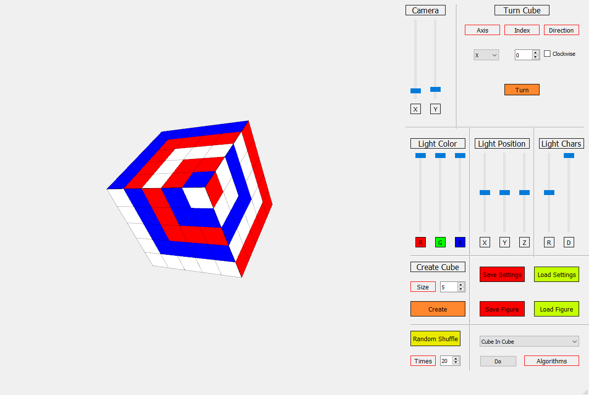

# RCPyQt

Rubik's Cube simulation written in Python

## Features
* PyQT5 used for building interface
* Cubes of any sizes allowed
* Light reflections on the cube
* Several cube algorithms and shuffling
